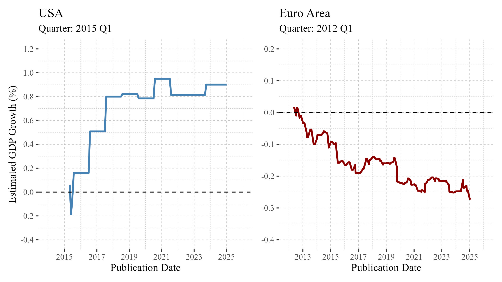
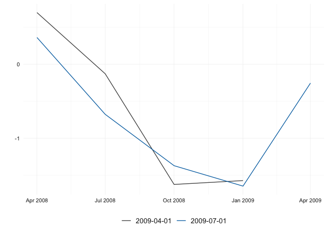

<!-- README.md is generated from README.Rmd. Please edit that file -->

# reviser 

<!-- badges: start -->

[](https://www.repostatus.org/#active)
[](https://github.com/p-wegmueller/reviser/actions/workflows/R-CMD-check.yaml)
[](https://github.com/p-wegmueller/reviser/actions?query=workflow%3Apkgcheck)
[](https://lifecycle.r-lib.org/articles/stages.html#stable)
[](https://marcburri.r-universe.dev/reviser)
[](https://app.codecov.io/gh/p-wegmueller/reviser)
<!-- badges: end -->

**reviser** is an R package designed for working with time-series
vintages data. The package provides tools to clean, visualize, and
analyze time-series revisions.

## Why reviser?

Economic data often arrives in multiple waves—with initial estimates
updated or revised as more complete information becomes available (See
the vignette [**the role and importance of
revisions**](https://p-wegmueller.github.io/reviser/articles/literature-review.html)).
These revisions, while common, can have major implications for how
economic conditions are perceived and how decisions are made by
policymakers, analysts, and markets. Yet, tools to systematically
analyze, visualize, and communicate these revisions are still limited.
This is where the R package **reviser** comes in.

**reviser** is built to support transparent, reproducible workflows for
tracking and interpreting data revisions. Whether you’re evaluating GDP
estimates, inflation statistics, or high-frequency indicators,
**reviser** helps quantify how vintages evolve, assess their
reliability, and highlight cases where revisions may alter the economic
narrative.

### Real-world relevance

The importance of revisions isn’t just academic. They shape real-world
outcomes:

<figure>

<figcaption aria-hidden="true">Revision paths for Euro Area GDP
(Sources: BEA, Eurostat)</figcaption>
</figure>

- US GDP 2015-Q1 — Weather or Weakness?: A sharp downward revision from
  +0.1% to -0.2% sparked fears of a slowdown—until a later benchmark
  revision lifted it back to +0.8%, highlighting challenges in seasonal
  adjustment.

- Euro Area GDP in 2012Q1 — A Recession Delayed?: A flash estimate of
  0.0% avoided the recession label—until it was revised to -0.1%,
  confirming back-to-back contractions and altering the policy
  discussion at a critical time.

These examples underscore how even small numerical changes can shift
narratives, delay responses, and affect credibility.

**reviser** is an R package designed to streamline the analysis and
visualization of data revisions—especially in the context of official
statistics and macroeconomic indicators. Built with tidy principles and
seamless integration in mind, reviser offers intuitive tools to compare
data vintages, quantify revision patterns, and produce publication-ready
outputs. Whether you’re tracking GDP estimate updates or evaluating
forecast accuracy over time, **reviser** provides a robust and flexible
framework tailored for economists, data analysts, and statistical
agencies alike.

The **reviser** package provides a comprehensive toolkit for analyzing
data revisions — crucial for anyone working with real-time data. It
allows users to **visualize**, **analyze**, and **evaluate** the impact
of data updates across different release vintages, helping to understand
and analyze revision patterns.

Get started:

- Structure your data according to **reviser conventions**. See the
  [*get
  started*](https://p-wegmueller.github.io/reviser/articles/reviser.html)
  vignette

Key features include:

- **Calculate revisions** across vintages using
  [`get_revisions()`](https://p-wegmueller.github.io/reviser/reference/get_revisions.html).
  See the vignette [*Understanding Data
  Revisions*](https://p-wegmueller.github.io/reviser/articles/understanding-revisions.html)
  to learn how to structure and compute revision tables.

- **Analyze revision patterns** and evaluate revision accuracy and bias
  using
  [`get_revision_analysis()`](https://p-wegmueller.github.io/reviser/reference/get_revision_analysis.html).
  For more, read the vignette [*Revision Patterns and
  Statistics*](https://p-wegmueller.github.io/reviser/articles/revision-analysis.html).

- **Detect the first efficient release**, i.e., the earliest vintage
  that closely matches the final values, with
  [`get_first_efficient_release()`](https://p-wegmueller.github.io/reviser/reference/get_first_efficient_release.html).
  See the vignette [*Efficient Release
  Identification*](https://p-wegmueller.github.io/reviser/articles/efficient-release.html).

- **Nowcast future data revisions** using
  [`kk_nowcast()`](https://p-wegmueller.github.io/reviser/reference/kk_nowcast.html),
  a tool to anticipate upcoming changes to early releases. Explore the
  methodology in the vignette [*Nowcasting
  Revisions*](https://p-wegmueller.github.io/reviser/articles/nowcasting-revisions.html).

## Installation

You can install the development version of reviser from
[GitHub](https://github.com/) with:

``` r
# Install the reviser package
remotes::install_github("p-wegmueller/reviser")
```

## Usage

The following example analyzes GDP data revisions for the United States
by transforming the data into a format suitable for vintage analysis,
visualizing revisions during the financial crisis, and assessing how
early estimates compare to the final release. It then identifies the
point at which the estimates become stable and reliable.

``` r
library(reviser)
library(dplyr)

gdp <- gdp %>% 
  filter(id == "US") %>%
  tsbox::ts_pc() %>% 
  tsbox::ts_span(start = "1980-01-01")

gdp_wide <- vintages_wide(gdp)

gdp_long <- vintages_long(gdp_wide, keep_na = FALSE)

plot_vintages(
  gdp_long %>% 
  filter(
    pub_date >= as.Date("2009-01-01") & pub_date < as.Date("2010-01-01"),
    time < as.Date("2010-01-01") & time > as.Date("2008-01-01")
    ),
  type = "line",
  title = "Revisions of GDP during the financial crisis",
  subtitle = "qoq growth rates")
```



``` r
  
final_release <- get_nth_release(gdp_long, n = 10)

df <- get_nth_release(gdp_long, n = 0:6)

summary <- get_revision_analysis(df, final_release)
print(summary)
#> # A tibble: 7 × 14
#>   id    release       N `Bias (mean)` `Bias (p-value)` `Bias (robust p-value)`
#>   <chr> <chr>     <dbl>         <dbl>            <dbl>                   <dbl>
#> 1 US    release_0   168      -0.0135             0.488                   0.520
#> 2 US    release_1   168      -0.0153             0.393                   0.425
#> 3 US    release_2   168      -0.0128             0.484                   0.507
#> 4 US    release_3   168      -0.00303            0.860                   0.851
#> 5 US    release_4   168      -0.0142             0.308                   0.326
#> 6 US    release_5   168      -0.0208             0.124                   0.181
#> 7 US    release_6   168      -0.0182             0.116                   0.202
#> # ℹ 8 more variables: Minimum <dbl>, Maximum <dbl>, `10Q` <dbl>, Median <dbl>,
#> #   `90Q` <dbl>, MAR <dbl>, `Std. Dev.` <dbl>, `Noise/Signal` <dbl>
```

``` r

efficient_release <- get_first_efficient_release(df, final_release)
summary(efficient_release)
#> Efficient release:  0 
#> 
#> Model summary: 
#> 
#> Call:
#> stats::lm(formula = formula, data = df_wide)
#> 
#> Residuals:
#>      Min       1Q   Median       3Q      Max 
#> -0.89186 -0.12669  0.02046  0.11475  0.97986 
#> 
#> Coefficients:
#>             Estimate Std. Error t value Pr(>|t|)    
#> (Intercept)  0.00299    0.02223   0.134    0.893    
#> release_0    0.97412    0.01692  57.567   <2e-16 ***
#> ---
#> Signif. codes:  0 '***' 0.001 '**' 0.01 '*' 0.05 '.' 0.1 ' ' 1
#> 
#> Residual standard error: 0.2518 on 166 degrees of freedom
#>   (10 observations deleted due to missingness)
#> Multiple R-squared:  0.9523, Adjusted R-squared:  0.952 
#> F-statistic:  3314 on 1 and 166 DF,  p-value: < 2.2e-16
#> 
#> 
#> Test summary: 
#> Linear hypothesis test
#> 
#> Hypothesis:
#> (Intercept) = 0
#> release_0 = 1
#> 
#> Model 1: restricted model
#> Model 2: final ~ release_0
#> 
#> Note: Coefficient covariance matrix supplied.
#> 
#>   Res.Df Df      F Pr(>F)
#> 1    168                 
#> 2    166  2 1.9283 0.1486
```

## Comparison to [`rjd3revisions`](https://rjdverse.github.io/rjd3revisions/)

The `reviser` package sets itself apart from `rjd3revisions` not only
through its focus on advanced analysis of efficient releases and
nowcasting performance, but also in its pure R implementation, which
avoids external dependencies. In contrast, `rjd3revisions` relies
heavily on Java via the JDemetra+ platform, which can make setup and
integration more complex. `reviser` offers a lightweight, R-native
solution for revision analysis, combining user-friendly tools for data
wrangling, visualization, and evaluation of release efficiency.

## Contributing

Contributions are encouraged and appreciated. If you’re uncertain about
opening a pull request, consider starting with an issue to discuss your
proposal. For more information, please refer to
[CONTRIBUTING](https://p-wegmueller.github.io/reviser/CONTRIBUTING.html).

Please note that the reviser project is released with a [Contributor
Code of
Conduct](https://p-wegmueller.github.io/reviser/CODE_OF_CONDUCT.html).
By contributing to this project, you agree to abide by its terms.

## Citation

Burri M, Wegmueller P (2025). reviser: Tools for Studying Revision
Properties in Real-Time Time Series Vintages. R package version 0.1.0,
<https://p-wegmueller.github.io/reviser/>.
