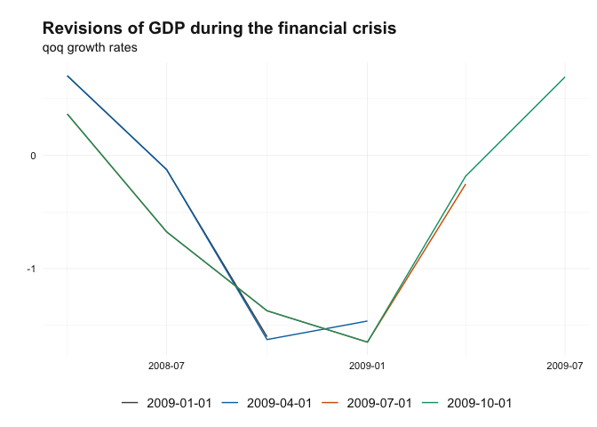

<!-- README.md is generated from README.Rmd. Please edit that file -->

# reviser 

<!-- badges: start -->

[](https://github.com/p-wegmueller/reviser/actions/workflows/R-CMD-check.yaml)
[](https://github.com/p-wegmueller/reviser/actions?query=workflow%3Apkgcheck)
[](https://lifecycle.r-lib.org/articles/stages.html#experimental)
<!-- badges: end -->

**reviser** is an R package designed for working with time-series
vintages data. The package provides tools to clean, visualize, and
analyze time-series revisions.

## Installation

You can install the development version of reviser from
[GitHub](https://github.com/) with:

``` r
# Install devtools if not already installed
# install.packages("devtools")

# Install the reviser package
devtools::install_github("p-wegmueller/reviser")
```

## Usage

``` r
library(reviser)
suppressMessages(library(dplyr))

gdp <- gdp %>% 
  filter(id == "US") %>%
  tsbox::ts_pc() %>% 
  tsbox::ts_span(start = "1980-01-01")

gdp_wide <- vintages_wide(gdp)

gdp_long <- vintages_long(gdp_wide, keep_na = FALSE)

plot_vintages(
  gdp_long %>% 
  filter(
    pub_date >= as.Date("2009-01-01") & pub_date < as.Date("2010-01-01"),
    time < as.Date("2010-01-01") & time > as.Date("2008-01-01")
    ),
  type = "line",
  title = "Revisions of GDP during the financial crisis",
  subtitle = "qoq growth rates")
```



``` r
  
final_release <- get_nth_release(gdp_long, n = 16)

df <- get_nth_release(gdp_long, n = 0:6)

summary <- get_revision_analysis(df, final_release)
#> Warning: Both 'release' and 'pub_date' columns are present in 'df. 
#>       The 'release' column will be used.
```

``` r
print(summary)
#> # A tibble: 7 × 14
#>   id    release       N `Bias (mean)` `Bias (p-value)` `Bias (robust p-value)`
#>   <chr> <chr>     <dbl>         <dbl>            <dbl>                   <dbl>
#> 1 US    release_0   162      -0.0172             0.439                   0.459
#> 2 US    release_1   162      -0.0186             0.377                   0.382
#> 3 US    release_2   162      -0.0157             0.458                   0.459
#> 4 US    release_3   162      -0.00553            0.783                   0.768
#> 5 US    release_4   162      -0.0166             0.326                   0.380
#> 6 US    release_5   162      -0.0231             0.138                   0.181
#> 7 US    release_6   162      -0.0208             0.144                   0.191
#> # ℹ 8 more variables: Minimum <dbl>, Maximum <dbl>, `10Q` <dbl>, Median <dbl>,
#> #   `90Q` <dbl>, MAR <dbl>, `Std. Dev.` <dbl>, `Noise/Signal` <dbl>
```

``` r

efficient_release <- get_first_efficient_release(df, final_release)
#> Warning: No efficient release found. Please provide further releases!
```

``` r
summary(efficient_release)
#> No efficient release found!
```
