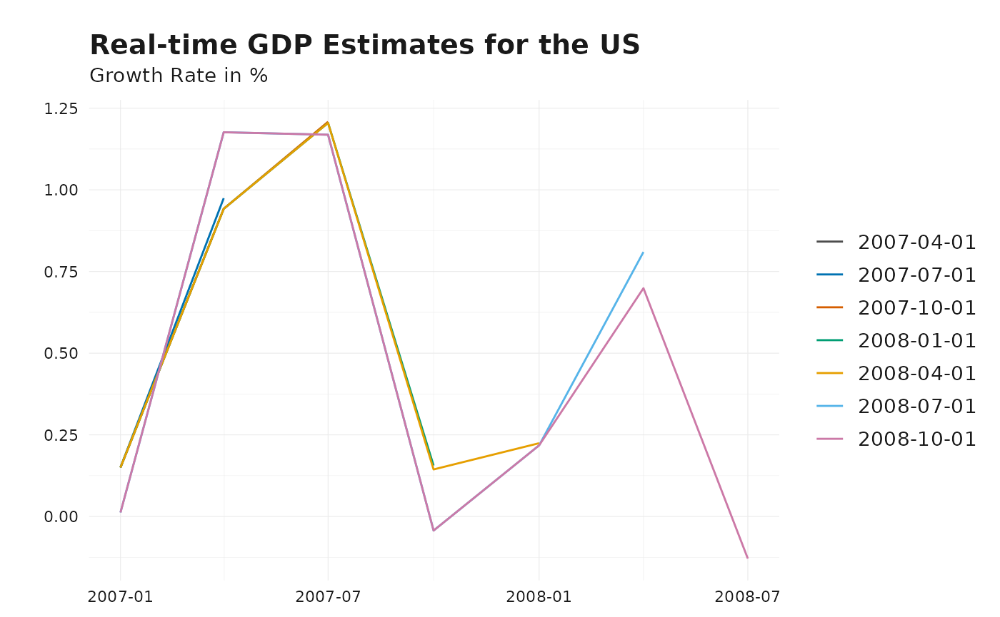
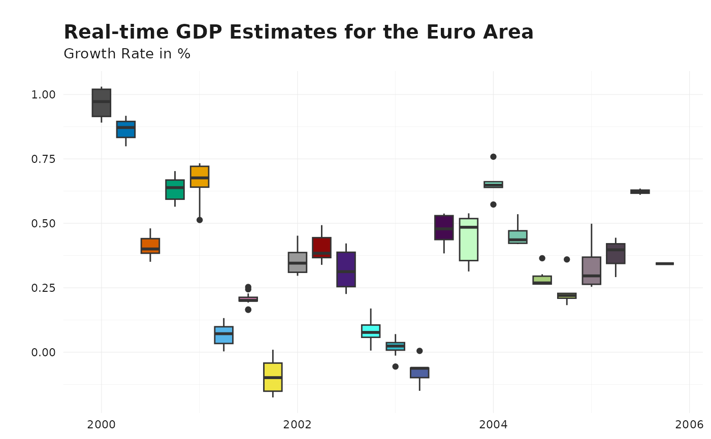

# Introduction to reviser

The `reviser` package provides tools to manipulate and analyze vintages
of time series data subject to revisions. This vignette demonstrates how
to get started and structure your data according to the package’s
conventions.

``` r
# The packages used in this vignette
library(reviser)
library(dplyr)
library(tsbox)
```

## Package conventions

------------------------------------------------------------------------

The most conventional way is to represent vintage data in a real-time
data matrix, where each **row** represents a time period and each
**column** represents successive releases of the data. This known as the
**wide format**. The package supports data in **wide format**. and
assumes that the data is organized in the following columns:

- `time`, the time period
- Publication dates in `'yyyy-mm-dd'` format or release numbers as
  `release_#`

While wide format is practical for inspection, data manipulation is
often easier in **long (tdy) format**, which consists of:

- `time`, the time period
- `pub_date` and/or `release`, the publication date or release number
- `value`, the reported value.
- `id`, an optional column to distinguish between different series

For illustration, the package provides a dataset in **long format**,
`gdp`. Below, we examine GDP growth rates for the US and Euro Area
during the 2007–2009 financial crisis.

``` r
# Example long-format US GDP data
data("gdp")
gdp_us_short <- gdp %>% 
  dplyr::filter(id == "US") %>%
  ts_pc() %>%
  filter(
    pub_date >= as.Date("2007-01-01"),
    pub_date < as.Date("2009-01-01"),
    time  >= as.Date("2007-01-01"),
    time < as.Date("2009-01-01")
  )

# Example long-format EA GDP data
gdp_ea_short <- gdp %>%
  dplyr::filter(id == "EA") %>%
  ts_pc() %>%
  filter(
    pub_date >= as.Date("2007-01-01"),
    pub_date < as.Date("2009-01-01"),
    time  >= as.Date("2007-01-01"),
    time < as.Date("2009-01-01")
  )

head(gdp_ea_short)
#> # A tibble: 6 × 4
#>   time       pub_date   value id   
#>   <date>     <date>     <dbl> <chr>
#> 1 2007-01-01 2007-04-01 0.603 EA   
#> 2 2007-01-01 2007-07-01 0.707 EA   
#> 3 2007-04-01 2007-07-01 0.349 EA   
#> 4 2007-01-01 2007-10-01 0.780 EA   
#> 5 2007-04-01 2007-10-01 0.310 EA   
#> 6 2007-07-01 2007-10-01 0.714 EA
```

## Convert Long to Wide Format

------------------------------------------------------------------------

To transform a dataset from **long format** to **wide format**, use
[`vintages_wide()`](https://p-wegmueller.github.io/reviser/reference/vintages_wide.md).
The function requires columns `time` and `value`, along with either
`pub_date` or `release`. An optional `id` column can be used to
distinguish between multiple series.

``` r
# Convert wide-format data to long format
wide_ea_short <- vintages_wide(gdp_ea_short)
head(wide_ea_short)
#> $EA
#> # A tibble: 7 × 8
#>   time       `2007-04-01` `2007-07-01` `2007-10-01` `2008-01-01` `2008-04-01`
#>   <date>            <dbl>        <dbl>        <dbl>        <dbl>        <dbl>
#> 1 2007-01-01        0.603        0.707        0.780        0.789        0.745
#> 2 2007-04-01       NA            0.349        0.310        0.274        0.334
#> 3 2007-07-01       NA           NA            0.714        0.750        0.721
#> 4 2007-10-01       NA           NA           NA            0.382        0.352
#> 5 2008-01-01       NA           NA           NA           NA            0.800
#> 6 2008-04-01       NA           NA           NA           NA           NA    
#> 7 2008-07-01       NA           NA           NA           NA           NA    
#> # ℹ 2 more variables: `2008-07-01` <dbl>, `2008-10-01` <dbl>
```

## Convert Wide to Long Format

------------------------------------------------------------------------

To revert to **long format**, use
[`vintages_long()`](https://p-wegmueller.github.io/reviser/reference/vintages_long.md).
The function expects column names in **wide format** to be valid dates
or contain the string `"release"`.

``` r
# Convert back to long format
long_ea_short <- vintages_long(wide_ea_short)
head(long_ea_short)
#> # A tibble: 6 × 4
#>   time       pub_date   value id   
#>   <date>     <chr>      <dbl> <chr>
#> 1 2007-01-01 2007-04-01 0.603 EA   
#> 2 2007-01-01 2007-07-01 0.707 EA   
#> 3 2007-01-01 2007-10-01 0.780 EA   
#> 4 2007-01-01 2008-01-01 0.789 EA   
#> 5 2007-01-01 2008-04-01 0.745 EA   
#> 6 2007-01-01 2008-07-01 0.745 EA
```

## Handling Multiple Series with `id`

------------------------------------------------------------------------

If an `id` column is present,
[`vintages_wide()`](https://p-wegmueller.github.io/reviser/reference/vintages_wide.md)
returns a **list** with one dataset per unique `id`. Conversely,
[`vintages_long()`](https://p-wegmueller.github.io/reviser/reference/vintages_long.md)
maintains the `id` column to distinguish between series.

``` r
gdp_short <- bind_rows(
  gdp_ea_short %>% mutate(id = "EA"),
  gdp_us_short %>% mutate(id = "US")
)
gdp_wide_short <- vintages_wide(gdp_short)
head(gdp_wide_short)
#> $EA
#> # A tibble: 7 × 8
#>   time       `2007-04-01` `2007-07-01` `2007-10-01` `2008-01-01` `2008-04-01`
#>   <date>            <dbl>        <dbl>        <dbl>        <dbl>        <dbl>
#> 1 2007-01-01        0.603        0.707        0.780        0.789        0.745
#> 2 2007-04-01       NA            0.349        0.310        0.274        0.334
#> 3 2007-07-01       NA           NA            0.714        0.750        0.721
#> 4 2007-10-01       NA           NA           NA            0.382        0.352
#> 5 2008-01-01       NA           NA           NA           NA            0.800
#> 6 2008-04-01       NA           NA           NA           NA           NA    
#> 7 2008-07-01       NA           NA           NA           NA           NA    
#> # ℹ 2 more variables: `2008-07-01` <dbl>, `2008-10-01` <dbl>
#> 
#> $US
#> # A tibble: 7 × 8
#>   time       `2007-04-01` `2007-07-01` `2007-10-01` `2008-01-01` `2008-04-01`
#>   <date>            <dbl>        <dbl>        <dbl>        <dbl>        <dbl>
#> 1 2007-01-01        0.162        0.150        0.150        0.150        0.150
#> 2 2007-04-01       NA            0.974        0.942        0.942        0.942
#> 3 2007-07-01       NA           NA            1.21         1.20         1.20 
#> 4 2007-10-01       NA           NA           NA            0.156        0.144
#> 5 2008-01-01       NA           NA           NA           NA            0.224
#> 6 2008-04-01       NA           NA           NA           NA           NA    
#> 7 2008-07-01       NA           NA           NA           NA           NA    
#> # ℹ 2 more variables: `2008-07-01` <dbl>, `2008-10-01` <dbl>
```

## Extracting Releases

------------------------------------------------------------------------

Once data follows the package conventions, it can be analyzed further. A
common task is assessing the **first release** of data, which
corresponds to the diagonal of the real-time data matrix. Use
[`get_nth_release()`](https://p-wegmueller.github.io/reviser/reference/get_nth_release.md)
to extract the **nth** release. This function is **0-indexed**, so the
first release corresponds to `n = 0`.

``` r
# Get the first release and check in wide format
gdp_releases <- get_nth_release(gdp_short, n = 0)
vintages_wide(gdp_releases)
#> Warning: Ignoring columns: release
#> $EA
#> # A tibble: 7 × 8
#>   time       `2007-04-01` `2007-07-01` `2007-10-01` `2008-01-01` `2008-04-01`
#>   <date>            <dbl>        <dbl>        <dbl>        <dbl>        <dbl>
#> 1 2007-01-01        0.603       NA           NA           NA           NA    
#> 2 2007-04-01       NA            0.349       NA           NA           NA    
#> 3 2007-07-01       NA           NA            0.714       NA           NA    
#> 4 2007-10-01       NA           NA           NA            0.382       NA    
#> 5 2008-01-01       NA           NA           NA           NA            0.800
#> 6 2008-04-01       NA           NA           NA           NA           NA    
#> 7 2008-07-01       NA           NA           NA           NA           NA    
#> # ℹ 2 more variables: `2008-07-01` <dbl>, `2008-10-01` <dbl>
#> 
#> $US
#> # A tibble: 7 × 8
#>   time       `2007-04-01` `2007-07-01` `2007-10-01` `2008-01-01` `2008-04-01`
#>   <date>            <dbl>        <dbl>        <dbl>        <dbl>        <dbl>
#> 1 2007-01-01        0.162       NA            NA          NA           NA    
#> 2 2007-04-01       NA            0.974        NA          NA           NA    
#> 3 2007-07-01       NA           NA             1.21       NA           NA    
#> 4 2007-10-01       NA           NA            NA           0.156       NA    
#> 5 2008-01-01       NA           NA            NA          NA            0.224
#> 6 2008-04-01       NA           NA            NA          NA           NA    
#> 7 2008-07-01       NA           NA            NA          NA           NA    
#> # ℹ 2 more variables: `2008-07-01` <dbl>, `2008-10-01` <dbl>

# The function uses the pub_date column by default to define columns in wide 
# format. Specifying the `names_from` argument allows to use the release column.
gdp_releases <- get_nth_release(gdp_short, n = 0:1)
vintages_wide(gdp_releases, names_from = "release")
#> Warning: Ignoring columns: pub_date
#> $EA
#> # A tibble: 7 × 3
#>   time       release_0 release_1
#>   <date>         <dbl>     <dbl>
#> 1 2007-01-01     0.603     0.707
#> 2 2007-04-01     0.349     0.310
#> 3 2007-07-01     0.714     0.750
#> 4 2007-10-01     0.382     0.352
#> 5 2008-01-01     0.800     0.700
#> 6 2008-04-01    -0.200    -0.170
#> 7 2008-07-01    -0.194    NA    
#> 
#> $US
#> # A tibble: 7 × 3
#>   time       release_0 release_1
#>   <date>         <dbl>     <dbl>
#> 1 2007-01-01     0.162     0.150
#> 2 2007-04-01     0.974     0.942
#> 3 2007-07-01     1.21      1.20 
#> 4 2007-10-01     0.156     0.144
#> 5 2008-01-01     0.224     0.218
#> 6 2008-04-01     0.810     0.699
#> 7 2008-07-01    -0.129    NA
```

To assess data accuracy, we need to define the **final release**. Since
many statistical agencies continue revising data indefinitely, the
**latest release** is often used as a benchmark.

Use `get_nth_release(n = "latest")` to extract the most recent vintage.

``` r
# Get the latest release
gdp_final <- get_nth_release(gdp_short, n = "latest")
vintages_wide(gdp_final)
#> Warning: Ignoring columns: release
#> $EA
#> # A tibble: 7 × 2
#>   time       `2008-10-01`
#>   <date>            <dbl>
#> 1 2007-01-01        0.728
#> 2 2007-04-01        0.477
#> 3 2007-07-01        0.555
#> 4 2007-10-01        0.354
#> 5 2008-01-01        0.661
#> 6 2008-04-01       -0.170
#> 7 2008-07-01       -0.194
#> 
#> $US
#> # A tibble: 7 × 2
#>   time       `2008-10-01`
#>   <date>            <dbl>
#> 1 2007-01-01       0.0123
#> 2 2007-04-01       1.18  
#> 3 2007-07-01       1.17  
#> 4 2007-10-01      -0.0430
#> 5 2008-01-01       0.218 
#> 6 2008-04-01       0.699 
#> 7 2008-07-01      -0.129
```

Some agencies **fix** their data after a certain period (e.g., Germany
finalizes GDP data in August four years after the initial release). The
function
[`get_fixed_release()`](https://p-wegmueller.github.io/reviser/reference/get_fixed_release.md)
extracts these fixed releases.

``` r
gdp_ea_longer <- gdp %>% 
  dplyr::filter(id == "EA") %>%
  ts_pc() %>% 
  filter(
    time >= as.Date("2000-01-01"),
    time < as.Date("2006-01-01"),
    pub_date >= as.Date("2000-01-01"),
    pub_date <= as.Date("2006-01-01")
    )

# Get the release from October four years after the initial release
gdp_releases <- get_fixed_release(
  gdp_ea_longer, 
  years = 4, 
  month = "October"
  )
gdp_releases
#> # A tibble: 8 × 4
#>   time       pub_date     value id   
#>   <date>     <date>       <dbl> <chr>
#> 1 2000-01-01 2004-10-01 0.905   EA   
#> 2 2000-04-01 2004-10-01 0.917   EA   
#> 3 2000-07-01 2004-10-01 0.387   EA   
#> 4 2000-10-01 2004-10-01 0.585   EA   
#> 5 2001-01-01 2005-10-01 0.723   EA   
#> 6 2001-04-01 2005-10-01 0.131   EA   
#> 7 2001-07-01 2005-10-01 0.199   EA   
#> 8 2001-10-01 2005-10-01 0.00809 EA
```

## Visualizing Vintage Data

------------------------------------------------------------------------

The `reviser` package provides simple and flexible tools for visualizing
real-time vintages. The primary function for this is
[`plot_vintages()`](https://p-wegmueller.github.io/reviser/reference/plot_vintages.md),
which supports multiple plot types, including line plots, scatter plots,
bar plots, and boxplots. It returns a `ggplot2` object, allowing for
further customization with the `ggplot2` package. This is a simple
function allowing to visualize real-time data in a few lines of code.
However, it is only possible to plot the data along one dimension
(either `pub_date`, `release` or `id`).

To use
[`plot_vintages()`](https://p-wegmueller.github.io/reviser/reference/plot_vintages.md),
provide a data frame containing:

- A `time` column (representing the observation period),
- A `value` column (containing the reported data),
- A column indicating the publication date (`pub_date`) or release
  number (`release`), which determines the dimension along which the
  data is visualized.

For example, to visualize how GDP estimates evolved over time, you can
create a line plot comparing different vintages:

``` r
# Line plot showing GDP vintages over the publication date dimension
plot_vintages(
  gdp_us_short,
  title = "Real-time GDP Estimates for the US",
  subtitle = "Growth Rate in %"
  )
```



``` r

# Line plot showing GDP vintages over the release dimension
gdp_releases <- get_nth_release(gdp_us_short, n = 0:3)
plot_vintages(gdp_releases, dim_col = "release")
```


By default, if `dim_col` (the dimension along which vintages are
plotted) contains more than 30 unique values, only the most recent 30
are displayed to maintain readability.

``` r
# Line plot showing GDP vintages over the publication date dimension
plot_vintages(
  gdp_ea_longer,
  type = "boxplot",
  title = "Real-time GDP Estimates for the Euro Area",
  subtitle = "Growth Rate in %"
  )
```



``` r

# Line plot showing GDP vintages over id dimension
plot_vintages(
  gdp %>% 
    ts_pc() %>% 
    get_latest_release() %>%
    na.omit(), 
  dim_col = "id",
  title = "Recent GDP Estimates",
  subtitle = "Growth Rate in %"
  )
```


For further customization, you can apply custom themes and color scales
using:

- [`scale_color_reviser()`](https://p-wegmueller.github.io/reviser/reference/theme_reviser.md)
- [`scale_fill_reviser()`](https://p-wegmueller.github.io/reviser/reference/theme_reviser.md)
- [`theme_reviser()`](https://p-wegmueller.github.io/reviser/reference/theme_reviser.md)

These functions ensure a consistent visual style tailored for vintage
data analysis.

## Analyzing Data Revisions and Releases

------------------------------------------------------------------------

After defining the final release, we can analyze revisions and releases
in multiple ways:

- Calculate revisions:
  [`get_revisions()`](https://p-wegmueller.github.io/reviser/reference/get_revisions.md).
  See vignette [Understanding Data
  Revisions](https://p-wegmueller.github.io/reviser/articles/understanding-revisions.md)
  for more details.  
- Analyze the revisions:
  [`get_revision_analysis()`](https://p-wegmueller.github.io/reviser/reference/get_revision_analysis.md).
  See vignette [Revision Patterns and
  Statistics](https://p-wegmueller.github.io/reviser/articles/revision-analysis.md)
  for more details.  
- Identify the first efficient release:
  [`get_first_efficient_release()`](https://p-wegmueller.github.io/reviser/reference/get_first_efficient_release.md).
  See vignette [Efficient Release
  Identification](https://p-wegmueller.github.io/reviser/articles/efficient-release.md)
  for more details.  
- Nowcast future revisions:
  [`kk_nowcast()`](https://p-wegmueller.github.io/reviser/reference/kk_nowcast.md).
  See vignette [Nowcasting
  Revisions](https://p-wegmueller.github.io/reviser/articles/nowcasting-revisions.md)
  for more details.
